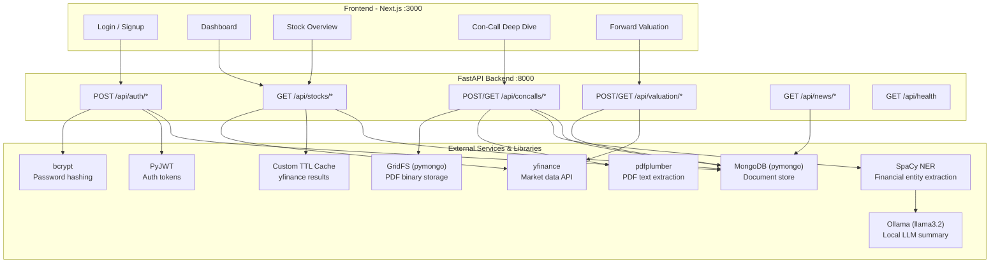
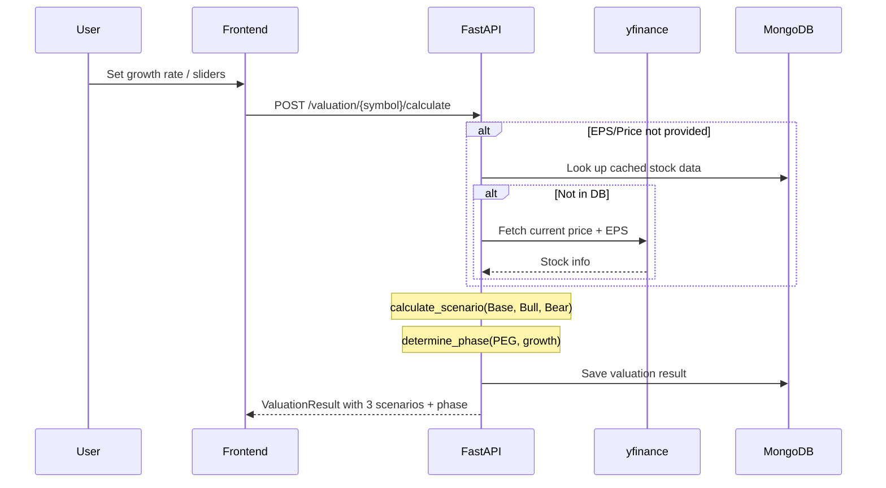
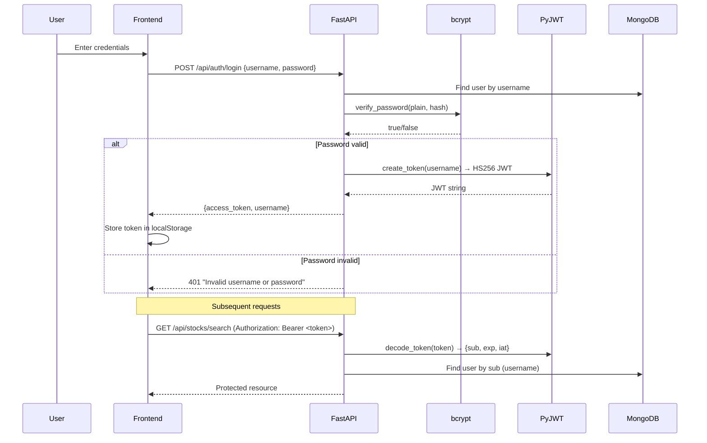

# QuantumStock — Architecture

## System Architecture



## Data Flow Diagrams

### Con-Call Analysis Pipeline

```mermaid
sequenceDiagram
    participant U as User
    participant FE as Frontend
    participant API as FastAPI
    participant GFS as GridFS
    participant PP as pdfplumber
    participant SP as SpaCy NER
    participant OL as Ollama
    participant DB as MongoDB

    U->>FE: Drop PDF files
    FE->>API: POST /concalls/{symbol}/upload (multipart)
    API->>GFS: Store PDF binary
    API->>PP: Extract text from PDF bytes
    PP-->>API: Raw text string
    API->>DB: Insert concall doc (raw_text, analysis=None)
    API-->>FE: Upload results (ids, text_length)

    U->>FE: Click "Analyze"
    FE->>API: POST /concalls/{symbol}/analyze
    API-->>FE: Queued (returns immediately)
    API->>DB: Set status=queued

    Note over API: Background worker (sequential)
    loop For each concall (one at a time)
        API->>DB: Set status=analyzing
        API->>SP: Extract entities (percentages, currencies, guidance)
        SP-->>API: Financial entities with context
        API->>API: SpaCy structured extraction (<2s)
        Note right of API: quarter, highlights, guidance, tone, flags, quotes
        API->>OL: Generate detailed markdown summary (~25s)
        OL-->>API: 600-1000 word research note
        API->>DB: Update with analysis, status=completed
    end

    loop Frontend polling (every 4s)
        FE->>API: GET /concalls/{symbol}
        API-->>FE: Status updates per concall
    end
```



### Valuation Calculation Flow



## Tech Stack Detail

| Component | Library | Version | Purpose | Where Used |
|-----------|---------|---------|---------|------------|
| **Database** | pymongo | 4.16 | Primary data store for all collections (users, stocks, concalls, financials, valuations) | `app/database.py` → all routers |
| **PDF Storage** | GridFS (pymongo) | — | Binary storage for uploaded con-call PDF files. Files stored in `fs.files` and `fs.chunks` collections | `app/concalls/router.py` upload endpoint |
| **LLM** | ollama | 0.6+ | Generates detailed markdown summary only (~25s). All structured extraction done by SpaCy. Default model: `llama3.2:latest` | `app/concalls/llm_analyzer.py` |
| **NLP Extraction** | spacy | 3.8 | Financial entity extraction + ALL structured data extraction (highlights, guidance, flags, scores, quotes) in <2s | `app/concalls/spacy_preprocessor.py`, `llm_analyzer.py` |
| **Market Data** | yfinance | 1.2 | Fetches real-time stock data from Yahoo Finance: price, PE ratio, EPS, market cap, sector, 52-week range | `app/stocks/yfinance_service.py` |
| **PDF Parsing** | pdfplumber | 0.11 | Extracts text content from PDF files page by page. Handles partial failures gracefully | `app/concalls/pdf_parser.py` |
| **Auth: Hashing** | bcrypt | 5.0 | Password hashing with 12 salt rounds. Used for both seed user creation and runtime authentication | `app/auth/utils.py`, `seed.py` |
| **Auth: Tokens** | PyJWT | 2.11 | JWT token creation (HS256) and validation with configurable expiry (default 24h) | `app/auth/utils.py` |
| **Caching** | Custom dict + TTL | — | In-memory dictionary cache with 15-minute TTL for yfinance API responses. Prevents excessive API calls | `app/stocks/yfinance_service.py` |
| **Config** | pydantic-settings | 2.13 | Type-safe environment variable loading from `.env` file with validation and defaults | `app/config.py` |
| **Web Framework** | FastAPI | 0.135 | ASGI web framework with automatic OpenAPI docs, request validation, dependency injection | `app/main.py` |
| **ASGI Server** | uvicorn | 0.41 | Production-grade ASGI server with hot-reload support for development | CLI entry point |
| **Scraping (stub)** | Scrapy | 2.14 | Placeholder for future BSE/NSE direct website scraping. Not actively used | `app/stocks/scraper_stub.py` |

## Authentication Flow



## Database Schema

### `users` Collection
```json
{
  "_id": "ObjectId",
  "username": "string (unique)",
  "password_hash": "string (bcrypt)",
  "created_at": "datetime (UTC)"
}
```

### `stocks` Collection
```json
{
  "_id": "ObjectId",
  "symbol": "string (unique, e.g. 'V2RETAIL.NS')",
  "name": "string",
  "exchange": "NSE | BSE",
  "sector": "string",
  "industry": "string",
  "market_cap": "float (INR crores)",
  "current_price": "float",
  "pe_ratio": "float",
  "eps": "float",
  "eps_growth": "float (%)",
  "dividend_yield": "float (%)",
  "week_52_high": "float",
  "week_52_low": "float",
  "lynch_category": "Fast Grower | Stalwart | Slow Grower | Cyclical | Turnaround | Asset Play",
  "last_updated": "datetime (UTC)"
}
```

### `concalls` Collection
```json
{
  "_id": "ObjectId",
  "stock_symbol": "string",
  "quarter": "string (e.g. 'Q3FY25')",
  "pdf_file_id": "ObjectId (GridFS reference)",
  "pdf_filename": "string",
  "raw_text": "string (extracted PDF text)",
  "analysis": {
    "quarter": "string",
    "highlights": ["string"],
    "tone_score": "int (1-10)",
    "guidance": {"key": "value"},
    "green_flags": ["string"],
    "red_flags": ["string"],
    "management_execution_score": "int (1-10)",
    "key_quotes": ["string"],
    "error": "string | null"
  },
  "uploaded_at": "datetime (UTC)",
  "uploaded_by": "string (username)",
  "analyzed_at": "datetime (UTC) | null"
}
```

### `financials` Collection
```json
{
  "_id": "ObjectId",
  "stock_symbol": "string",
  "period": "string (e.g. 'Q3FY25')",
  "revenue": "float | null",
  "pat": "float | null",
  "eps": "float | null",
  "margin": "float | null",
  "source": "manual | yfinance"
}
```

### `valuations` Collection
```json
{
  "_id": "ObjectId",
  "stock_symbol": "string",
  "scenarios": {
    "symbol": "string",
    "current_price": "float",
    "current_eps": "float",
    "current_pe": "float",
    "base": "ScenarioResult",
    "bull": "ScenarioResult",
    "bear": "ScenarioResult",
    "overall_phase": "string",
    "overall_phase_label": "string"
  },
  "phase": "string",
  "peg": "float",
  "upside_pct": "float",
  "created_at": "datetime (UTC)",
  "created_by": "string (username)"
}
```

## Design Decisions

1. **MongoDB over SQL**: Document model fits the semi-structured nature of LLM outputs and flexible financial data shapes. GridFS provides built-in binary storage without external object stores.

2. **Custom TTL cache over Redis**: For a local single-user app, a Python dict with timestamp-based eviction is simpler than running a separate Redis instance. The cache only stores yfinance results (15-min TTL).

3. **SpaCy-first, LLM-optional architecture**: SpaCy + regex extracts ALL structured data (highlights, guidance, flags, scores, quotes) instantly (<2 seconds). Ollama generates ONLY the detailed markdown summary (~25s). This means analysis always completes — even if Ollama fails, all structured fields are populated. The approach is 10-15x faster than the previous all-LLM pipeline.

4. **Sequential worker queue**: Ollama processes one request at a time. Parallel threads would just cause contention. A `queue.Queue` + single worker thread ensures efficient sequential processing. The frontend polls for status updates every 4 seconds.

5. **`llama3.2` over `mistral:7b`**: Benchmarked at 54 tok/s vs 22 tok/s. Since the LLM only generates summaries (not structured JSON), the smaller 3B model produces equally good results at 2.4x the speed.

6. **No async MongoDB driver**: pymongo is synchronous. FastAPI runs sync endpoints in a thread pool automatically, which is sufficient for a local single-user app. Motor (async pymongo) would add complexity without meaningful benefit here.

7. **JWT with auto-generated secret**: If `JWT_SECRET` is not set in `.env`, a new one is generated on each restart. This is acceptable for local development but means sessions won't survive restarts.
